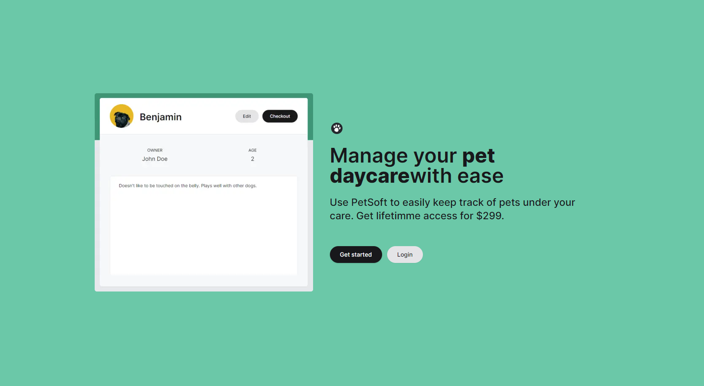

<!-- Improved compatibility of back to top link: See: https://github.com/othneildrew/Best-README-Template/pull/73 -->

<a id="readme-top"></a>

<!--
*** Thanks for checking out the Best-README-Template. If you have a suggestion
*** that would make this better, please fork the repo and create a pull request
*** or simply open an issue with the tag "enhancement".
*** Don't forget to give the project a star!
*** Thanks again! Now go create something AMAZING! :D
-->

<!-- PROJECT SHIELDS -->
<!--
*** I'm using markdown "reference style" links for readability.
*** Reference links are enclosed in brackets [ ] instead of parentheses ( ).
*** See the bottom of this document for the declaration of the reference variables
*** for contributors-url, forks-url, etc. This is an optional, concise syntax you may use.
*** https://www.markdownguide.org/basic-syntax/#reference-style-links
-->

<div align="center">
    <a href"mailto:aman304gupta@gmail.com">
        
    </a>
    <a href="https://www.linkedin.com/in/aman304gupta/">
      
    </a>
    <a href="https://aman304gupta-portfolio.vercel.app/">
      
    </a>
</div>

<!-- PROJECT LOGO -->
<br />
<div align="center">
  <a href="https://pet-daycare-software.vercel.app/">
    
  </a>

<h3 align="center">PetDaycare Software </h3>

  <p align="center">
    A NextJs full-stack project for pet daycare!
    <br />
    <!-- <a href="https://github.com/aman304gupta/petsoft-project"><strong>Explore the docs »</strong></a>
    <br /> -->
    <br />
    <a href="https://pet-daycare-software.vercel.app/">View Demo</a>
    ·
    <a href="https://github.com/aman304gupta/petsoft-project/issues/new?labels=bug&template=bug-report---.md">Report Bug</a>
    ·
    <a href="https://github.com/aman304gupta/petsoft-project/issues/new?labels=enhancement&template=feature-request---.md">Request Feature</a>
  </p>
</div>

<!-- TABLE OF CONTENTS -->
<details>
  <summary>Table of Contents</summary>
  <ol>
    <li>
      <a href="#about-the-project">About The Project</a>
      <ul>
        <li><a href="#built-with">Built With</a></li>
      </ul>
    </li>
    <li><a href="#features">Features</a></li>
    <li><a href="#learnings">Learnings</a></li>
    <li><a href="#usage">Usage</a></li>
    <li><a href="#product-screenshots">Product Screenshots</a></li>
    <li><a href="#Architecture">Architecture</a></li>
    <li>
      <a href="#getting-started">Getting Started</a>
      <ul>
        <li><a href="#prerequisites">Prerequisites</a></li>
        <li><a href="#installation">Installation</a></li>
      </ul>
    </li>
    <li><a href="#roadmap">Roadmap</a></li>
    <li><a href="#acknowledgments">Acknowledgments</a></li>
  </ol>
</details>

<!-- ABOUT THE PROJECT -->

## About The Project

---

[](https://pet-daycare-software.vercel.app/)

<!-- Here's a blank template to get started: To avoid retyping too much info. Do a search and replace with your text editor for the following: `aman304gupta`, `petsoft-project`, `twitter_handle`, `aman304gupta`, `email_client`, `email`, `project_title`, `project_description` -->

A side project to learn new concepts of NextJs.
<br />
<br />
This software is for PetDaycare organization for easier checking in/checking out of pets.

<p align="right">(<a href="#readme-top">back to top</a>)</p>

### Built With

---

- [![Next.js][nextjs-logo]](https://nextjs.org/)
- [![React][react-logo]](https://reactjs.org/)
- [![TypeScript][typescript-logo]](https://www.typescriptlang.org/)
- [![PostgreSQL][postgres-logo]](https://www.postgresql.org/)
- [![Stripe][stripe-logo]](https://stripe.com/)
- [![Tailwind CSS][tailwind-logo]](https://tailwindcss.com/)
- [![Prisma][prisma-logo]](https://www.prisma.io/)

<p align="right">(<a href="#readme-top">back to top</a>)</p>

<!-- Features -->

## Features

---

- **User Authentication**: Secure login and signup functionality for users.
- **Payment Integration**: Seamless payment processing using the Stripe API.
- **Pet Check-in/Check-out**: Streamlined process for checking pets in and out of the facility.
- **User-specific Database**: Personalized data management ensuring each user's data is stored and accessed securely.

<p align="right">(<a href="#readme-top">back to top</a>)</p>

<!-- Learning -->

## Learnings

---

- **Next.js Server Actions**: Leveraging Next.js "server actions" for server-side operations without a full-fledged backend.
- **State Management**: Implementing a state management system using a context provider.
- **Authentication Middleware**: Using Next.js' middleware for authentication with NextAuth.
- **JWT**: Utilizing JWT tokens for secure authentication
- **Prisma**: Using Prisma for interacting with the PostgreSQL databas
- **Stripe** : Integrating Stripe API and webhooks to implement payment functionalit
- **Validation with Zod**: Applying server-side and client-side validation using Zod.
- **ShadCN**: For responsive and modern UI components.
- **Form Management**: Implementing forms efficiently with React Hook Form.
- **Optimistic UI**: Enhancing user experience with the useOptimistic() hook in React/Next.js.
- **Styling with Tailwind CSS**: Utilizing Tailwind CSS for responsive and modern design.

<p align="right">(<a href="#readme-top">back to top</a>)</p>

<!-- USAGE EXAMPLES -->

## Usage

---

- Either login using the example username and password:
  - **Username**: `example@gmail.com`
  - **Password**: `example`
- Or create a new username and password. You will be redirected to the payment page. Pay using the sample credit card number:
  - **Credit Card Number**: `4242 4242 4242 4242`
  - **Expiry Date**: `05/55`
  - **For other fields**: Any random value

<p align="right">(<a href="#readme-top">back to top</a>)</p>

<!-- Product Screenshots -->

## Product Screenshots

---

<!-- 


 -->

Here are some screenshots of the project:

<p align="center">
  
  
</p>

<p align="center">
  
  
</p>

<p align="right">(<a href="#readme-top">back to top</a>)</p>

<!-- Architecture -->

## Architecture

---

Architecture

<p align="center">
  
</p>

Component Tree

<p align="center">
  
</p>

<p align="right">(<a href="#readme-top">back to top</a>)</p>

<!-- GETTING STARTED -->

## Getting Started

---

### Prerequisites

Latest version of npm

- npm
  ```sh
  npm install npm@latest -g
  ```

### Installation

1. Clone the repo
   ```sh
   git clone https://github.com/aman304gupta/petsoft-project.git
   ```
2. Install NPM packages
   ```sh
   npm install
   ```
3. Setup Prisma for Postgres and update env variables.
4. SetUp Strip and update env variables
5. Setup ngrok for strip webhook
6. Run locally
   ```sh
   npm run dev
   ```

<p align="right">(<a href="#readme-top">back to top</a>)</p>

<!-- ROADMAP -->

## Roadmap

---

- [ ] Session instead of JWT
- [ ] Payment after login
- [ ] Email Verification

<p align="right">(<a href="#readme-top">back to top</a>)</p>

<!-- ACKNOWLEDGMENTS -->

## Acknowledgments

- [Bytegrad](https://www.youtube.com/@ByteGrad)

<p align="right">(<a href="#readme-top">back to top</a>)</p>

<!-- MARKDOWN LINKS & IMAGES -->
<!-- https://www.markdownguide.org/basic-syntax/#reference-style-links -->

[contributors-shield]: https://img.shields.io/github/contributors/aman304gupta/petsoft-project.svg?style=for-the-badge
[contributors-url]: https://github.com/aman304gupta/petsoft-project/graphs/contributors
[forks-shield]: https://img.shields.io/github/forks/aman304gupta/petsoft-project.svg?style=for-the-badge
[forks-url]: https://github.com/aman304gupta/petsoft-project/network/members
[stars-shield]: https://img.shields.io/github/stars/aman304gupta/petsoft-project.svg?style=for-the-badge
[stars-url]: https://github.com/aman304gupta/petsoft-project/stargazers
[issues-shield]: https://img.shields.io/github/issues/aman304gupta/petsoft-project.svg?style=for-the-badge
[issues-url]: https://github.com/aman304gupta/petsoft-project/issues
[license-shield]: https://img.shields.io/github/license/aman304gupta/petsoft-project.svg?style=for-the-badge
[license-url]: https://github.com/aman304gupta/petsoft-project/blob/master/LICENSE.txt
[linkedin-url]: https://linkedin.com/in/aman304gupta
[Next.js]: https://img.shields.io/badge/next.js-000000?style=for-the-badge&logo=nextdotjs&logoColor=white
[Next-url]: https://nextjs.org/
[React.js]: https://img.shields.io/badge/React-20232A?style=for-the-badge&logo=react&logoColor=61DAFB
[React-url]: https://reactjs.org/
[nextjs-logo]: https://img.shields.io/badge/Next.js-000000?style=for-the-badge&logo=next.js&logoColor=white
[react-logo]: https://img.shields.io/badge/React-20232A?style=for-the-badge&logo=react&logoColor=61DAFB
[typescript-logo]: https://img.shields.io/badge/TypeScript-007ACC?style=for-the-badge&logo=typescript&logoColor=white
[postgres-logo]: https://img.shields.io/badge/PostgreSQL-336791?style=for-the-badge&logo=postgresql&logoColor=white
[stripe-logo]: https://img.shields.io/badge/Stripe-008CDD?style=for-the-badge&logo=stripe&logoColor=white
[tailwind-logo]: https://img.shields.io/badge/Tailwind_CSS-38B2AC?style=for-the-badge&logo=tailwind-css&logoColor=white
[prisma-logo]: https://img.shields.io/badge/Prisma-2D3748?style=for-the-badge&logo=prisma&logoColor=white
